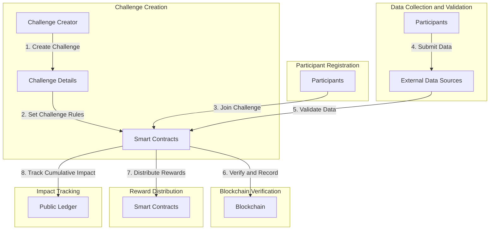
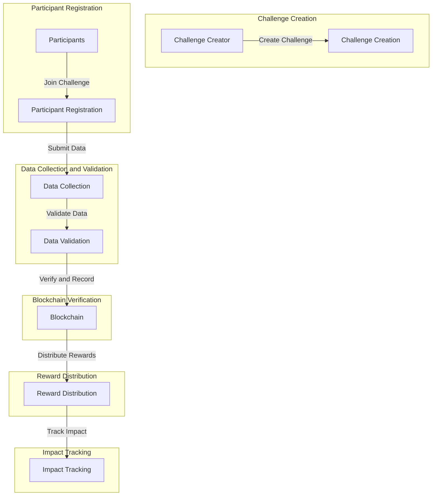
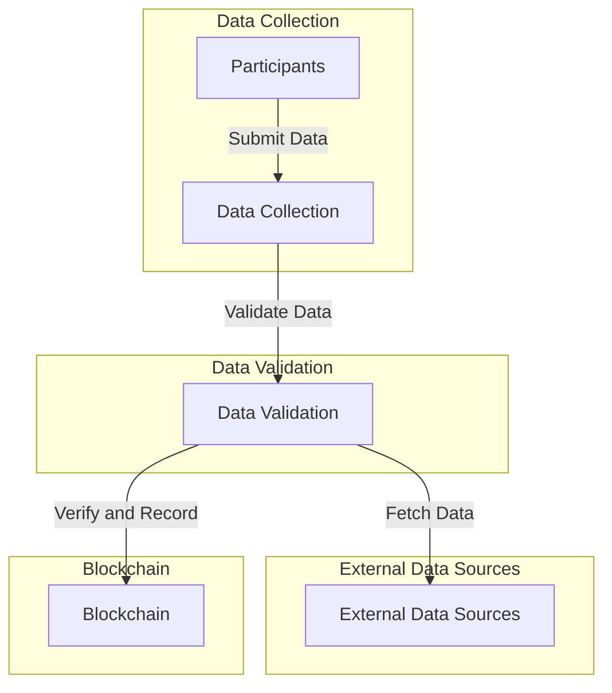

# Blockchain-Based Carbon Reduction Challenge Platform

## Project Overview
The Blockchain-Based Carbon Reduction Challenge Platform aims to motivate individuals, businesses, and communities to actively reduce their carbon emissions through engaging challenges. This report provides a comprehensive overview of the project, including its objectives, implementation steps, advantages, and reasoning behind design decisions.

## Objectives
The primary objectives of the project are as follows:

1. Encourage participants to take meaningful actions to reduce carbon emissions.
2. Provide a transparent and secure platform for tracking carbon reduction activities.
3. Incentivize participants with rewards in the form of carbon credits.
4. Create a public ledger showcasing the cumulative carbon reduction impact.

## Implementation Steps

### Step 1: Challenge Creation
- **Objective:** Enable users or organizations to create carbon reduction challenges.
- **Implementation:** Implement a user-friendly interface that allows challenge creators to specify challenge details, such as name, duration, eligible activities, and rewards.
- **Advantages:** Empowers users to customize challenges to target specific carbon reduction goals.

### Step 2: Smart Contracts for Challenge Rules
- **Objective:** Define and enforce the rules of each challenge.
- **Implementation:** Use Solidity to create smart contracts that automate challenge rules, including tracking participants' progress and validating their submissions.
- **Advantages:** Ensures fairness, transparency, and automation in challenge management.

### Step 3: Participant Registration
- **Objective:** Enable participants to join carbon reduction challenges.
- **Implementation:** Develop a registration system where participants provide their details and commit to reducing carbon emissions through specific actions.
- **Advantages:** Creates a clear record of participants' commitment to carbon reduction.

### Step 4: Data Collection and Validation
- **Objective:** Collect and validate data related to participants' carbon reduction activities.
- **Implementation:** Integrate with external data sources or oracles (e.g., Chainlink) to collect real-world data, such as energy consumption records or transportation logs.
- **Advantages:** Ensures accuracy and reliability of carbon reduction data.

### Step 5: Blockchain Verification
- **Objective:** Use blockchain to verify, record, and timestamp validated data.
- **Implementation:** Store validated data on the blockchain, making it immutable and transparent.
- **Advantages:** Provides a secure and tamper-proof record of carbon reduction achievements.

### Step 6: Reward Distribution
- **Objective:** Automatically distribute rewards to participants who achieve their carbon reduction goals.
- **Implementation:** Smart contracts facilitate the distribution of rewards in the form of carbon credits or cryptocurrency tokens.
- **Advantages:** Ensures fair and timely reward distribution without the need for intermediaries.

### Step 7: Impact Tracking
- **Objective:** Track and showcase the cumulative carbon reduction impact.
- **Implementation:** Develop a public ledger that displays the total carbon emissions reduced through all challenges on the platform.
- **Advantages:** Motivates further participation by highlighting the collective impact.

## Advantages of the Project

1. **Incentivizing Carbon Reduction:** The project motivates individuals and organizations to actively participate in carbon reduction efforts by offering real rewards in the form of carbon credits.

2. **Security and Transparency:** Carbon credits are securely stored on the blockchain, ensuring transparency, immutability, and reduced fraud potential. Once a credit is sold, it cannot be duplicated or resold elsewhere.

3. **Community Building:** The platform fosters a sense of community by bringing together like-minded individuals and organizations committed to environmental sustainability.

4. **Public Ledger:** The public ledger showcases the cumulative carbon reduction impact, inspiring more participation and creating awareness about the importance of carbon reduction.

5. **Automation:** Smart contracts automate various aspects of challenge management, including data validation and reward distribution, reducing the need for manual intervention.

6. **Data Reliability:** Integration with external data sources and oracles ensures that carbon reduction data is accurate and verifiable.

## Reasoning for Design Decisions

- **Blockchain Technology:** Blockchain provides the foundation for transparent, secure, and tamper-proof record-keeping, making it an ideal choice for tracking carbon reduction achievements and managing rewards.

- **Smart Contracts:** Smart contracts automate complex processes, reducing the risk of errors and ensuring fairness in challenge management.

- **Real-World Data Integration:** Integrating with real-world data sources and oracles enhances the reliability and credibility of carbon reduction data.

- **Gamification:** The gamification aspect of challenges makes carbon reduction engaging and encourages long-term participation.

## Project Workflow

## High-Level Data Flow Diagram

## Low-Level Data Flow Diagram (Data Collection and Validation)

## Advantages of the Project

[Incentivizing Carbon Reduction]
[Security and Transparency]
[Community Building]
[Public Ledger]
[Automation]
[Data Reliability]

## Conclusion
The Blockchain-Based Carbon Reduction Challenge Platform offers an innovative and engaging approach to addressing carbon emissions. By providing incentives, transparency, and a sense of community, it has the potential to inspire positive environmental change on a global scale. The use of blockchain technology ensures the security and reliability of data, making it a powerful tool in the fight against climate change. Further development and collaboration with environmental organizations and stakeholders will be essential to realize the project's full potential.

