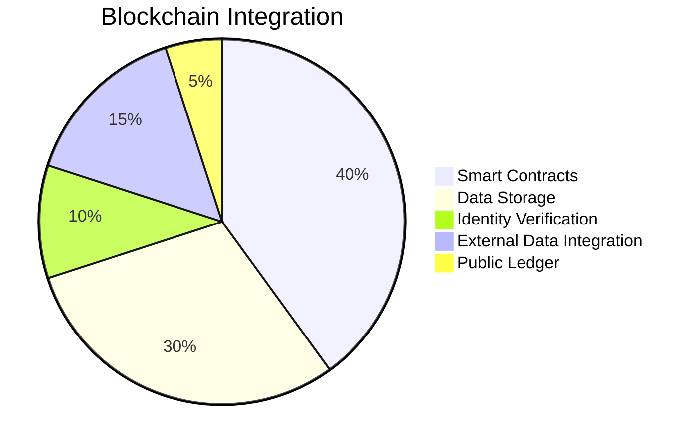
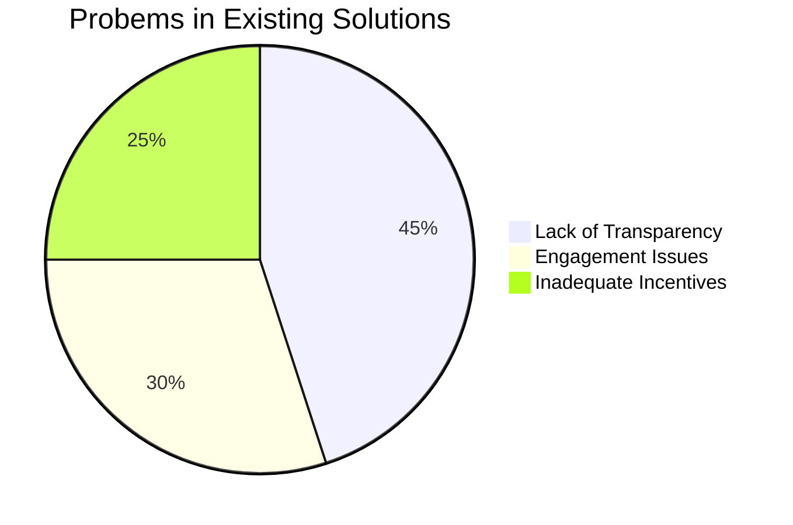
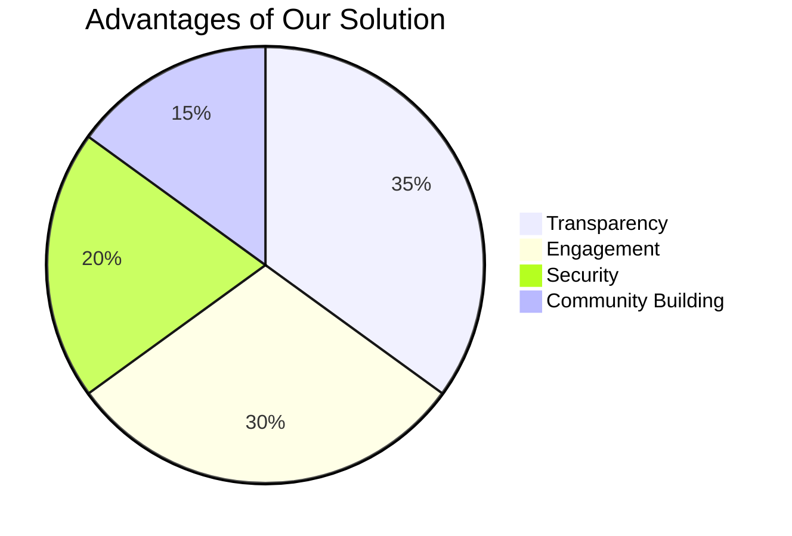
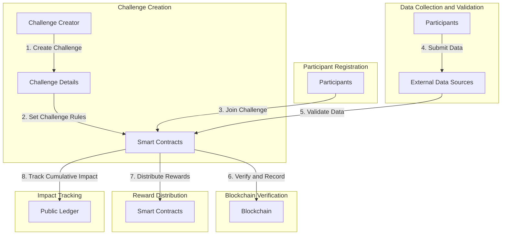
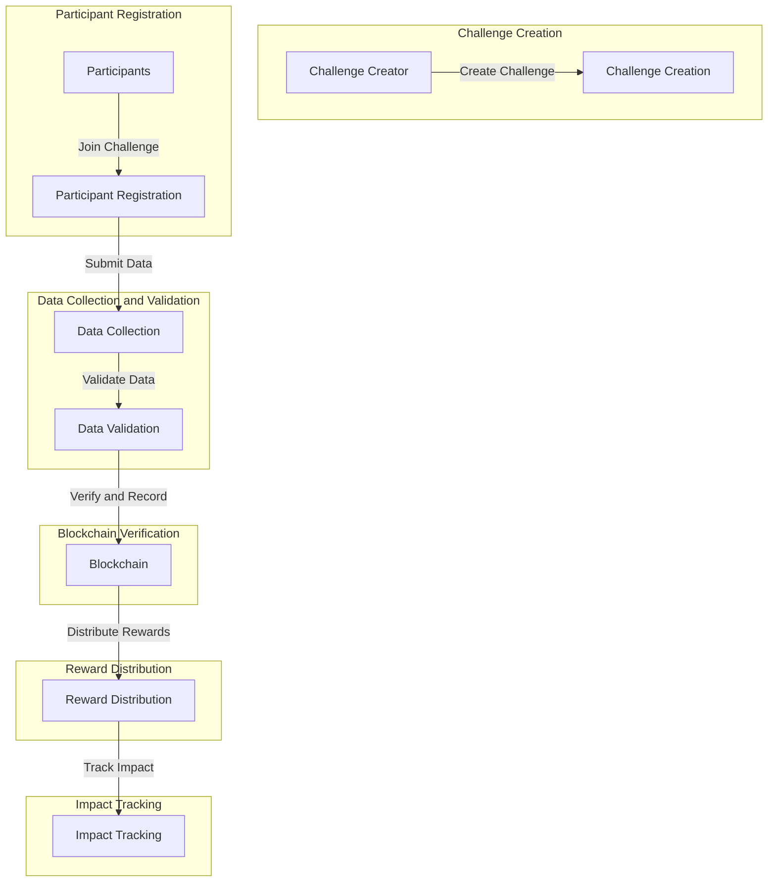
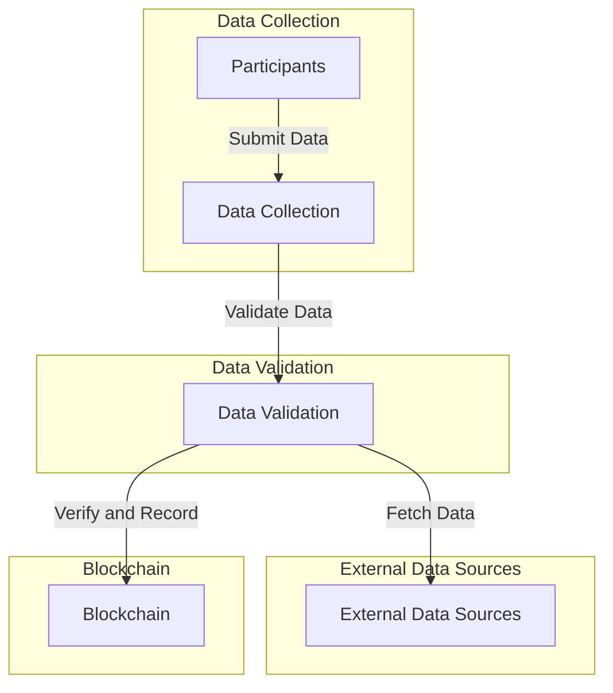
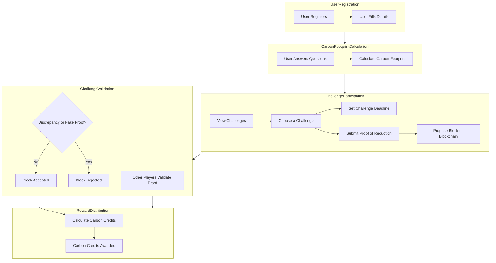

# Blockchain-Based Carbon Reduction Challenge Platform

# Contents:
- [Problem Statement](https://github.com/A-GHOSH-dev/blockchain-project#problem-statement)
- [Proposed Solution and Motivation](https://github.com/A-GHOSH-dev/blockchain-project#proposed-solution)
- [Project Overview](https://github.com/A-GHOSH-dev/blockchain-project#project-overview)
- [Implementation Steps](https://github.com/A-GHOSH-dev/blockchain-project#implementation-steps)
- [Blockchain Integration Overview](https://github.com/A-GHOSH-dev/blockchain-project#blockchain-integration-overview)
- [Novelty of the proposed work and Advantages of the Project](https://github.com/A-GHOSH-dev/blockchain-project#advantages-of-the-project)
- [Existing Solutions vs. Blockchain-Based Carbon Reduction Challenge Platform](https://github.com/A-GHOSH-dev/blockchain-project#existing-solutions-vs-blockchain-based-carbon-reduction-challenge-platform)
- [Literature Review](https://github.com/A-GHOSH-dev/blockchain-project#literature-review)
- [Project Workflow with Technology Stack](https://github.com/A-GHOSH-dev/blockchain-project#project-workflow)
- [Detailed Project Workflow](https://github.com/A-GHOSH-dev/blockchain-project#workflow)
- [Results and discussion on findings]()
- [Conclusion](https://github.com/A-GHOSH-dev/blockchain-project#conclusion)
- [References](https://github.com/A-GHOSH-dev/blockchain-project#references)

## Problem Statement
**Background:**
Carbon emissions and climate change are pressing global concerns. Reducing carbon emissions at an individual, community, and corporate level is essential. Existing carbon reduction initiatives lack transparency, engagement, and incentives for meaningful participation. There is a need for a platform that can address these shortcomings.

### Carbon Reduction, Net Zero Emissions, and Carbon Trading

The increasing concentration of greenhouse gases, primarily carbon dioxide (CO2), in the Earth's atmosphere is contributing to global warming and climate change. Carbon reduction, achieving net-zero emissions, and carbon trading are critical strategies to combat climate change. This document provides an in-depth explanation of these concepts.

### Carbon Reduction

#### Importance of Carbon Reduction

Carbon reduction refers to the process of decreasing the emission of carbon dioxide and other greenhouse gases into the atmosphere. It is essential for several reasons:

- **Mitigating Climate Change:** Reducing carbon emissions is vital to limit global warming and prevent catastrophic climate change impacts.

- **Environmental Preservation:** Lower emissions lead to reduced air pollution, better air quality, and preservation of ecosystems.

- **Economic Benefits:** Transitioning to a low-carbon economy can stimulate innovation and create green jobs.

### Net Zero Emissions

#### Definition

**Net zero emissions** refer to the balance between the amount of greenhouse gases emitted into the atmosphere and the amount removed from it. Achieving net zero means that any remaining emissions are offset by actions such as reforestation or carbon capture.

#### Importance

- **Climate Stability:** Achieving net zero emissions is crucial for stabilizing global temperatures and preventing severe climate events.

- **Global Commitments:** Many countries and organizations have committed to achieving net zero emissions by mid-century to comply with international climate agreements like the Paris Agreement.

### Carbon Reduction Protocols

Several protocols and agreements outline frameworks for carbon reduction:

1. **Kyoto Protocol:** An international treaty that set binding emission reduction targets for developed countries.

2. **Paris Agreement:** An accord within the United Nations Framework Convention on Climate Change (UNFCCC) that aims to limit global warming to well below 2 degrees Celsius above pre-industrial levels.

3. **RE100:** A global initiative where companies commit to using 100% renewable energy.

### Carbon Credits

#### Definition

**Carbon credits** are a tradable commodity that represent a reduction or removal of one metric ton of carbon dioxide equivalent (CO2e) emissions from the atmosphere. They are a crucial part of carbon reduction efforts.

### How Carbon Credits Work

- **Emission Reduction Projects:** Projects like renewable energy installations, afforestation, or methane capture generate carbon credits by reducing emissions.

- **Verification:** Independent third-party auditors verify and validate the emission reductions.

- **Issuance:** After verification, carbon credits are issued and registered.

- **Trading:** Credits can be bought and sold on carbon markets.

### Advantages

- **Incentivizing Emission Reduction:** Carbon credits provide a financial incentive for organizations to reduce emissions.

- **Flexibility:** Credits can be used to offset emissions that are challenging to eliminate.

### Carbon Offsetting and Trading

#### Carbon Offsetting

**Carbon offsetting** involves compensating for one's own carbon emissions by investing in projects that reduce or capture an equivalent amount of emissions elsewhere. This can include supporting renewable energy projects, reforestation, or methane capture initiatives.

#### Carbon Trading

**Carbon trading** is a market-based approach where organizations buy and sell carbon credits. It allows for the efficient distribution of emissions reductions.

Carbon reduction, achieving net-zero emissions, and carbon trading are vital strategies in the fight against climate change. By understanding these concepts and participating in carbon reduction efforts, individuals and organizations can contribute to a more sustainable and climate-resilient future.

## Proposed Solution
The "Blockchain-Based Carbon Reduction Challenge Platform" is designed to tackle the problems associated with existing carbon reduction initiatives. It offers an engaging and transparent solution that motivates individuals and organizations to actively reduce their carbon emissions.

## Motivation
### Environmental Impact
- Global warming, climate change, and their consequences are motivating factors.
- Raising awareness about carbon reduction's positive impact on the environment.

### Transparency
- Existing systems often lack transparency, leading to mistrust.
- Blockchain ensures transparency, immutability, and auditability of data.

### Incentives
- Incentivizing participants with carbon credits and tokens.
- Motivating individuals and organizations to adopt sustainable practices.

## Contribution to the Domain
- **Transparency:** Utilizing blockchain technology to make the entire process transparent and tamper-proof.
- **Engagement:** Gamification elements motivate participants to sustain their carbon reduction efforts.
- **Security:** Secure data storage and smart contracts eliminate fraud risks.
- **Community Building:** Fostering a community committed to carbon reduction.

## Project Overview
The Blockchain-Based Carbon Reduction Challenge Platform aims to motivate individuals, businesses, and communities to actively reduce their carbon emissions through engaging challenges. This report provides a comprehensive overview of the project, including its objectives, implementation steps, advantages, and reasoning behind design decisions. Blockchain-powered platform that encourages individuals, businesses, and communities to participate in carbon reduction challenges. This idea leverages gamification, social impact, and blockchain's transparency to inspire positive environmental change.

## Objectives
The primary objectives of the project are as follows:

1. Encourage participants to take meaningful actions to reduce carbon emissions.
2. Provide a transparent and secure platform for tracking carbon reduction activities.
3. Incentivize participants with rewards in the form of carbon credits.
4. Create a public ledger showcasing the cumulative carbon reduction impact.
5. Gamification, social impact, and blockchain's transparency to inspire positive environmental change

## Implementation Steps

### Step 1: Challenge Creation
- **Objective:** Enable users or organizations to create carbon reduction challenges.
- **Implementation:** Implement a user-friendly interface that allows challenge creators to specify challenge details, such as name, duration, eligible activities, and rewards.
- **Advantages:** Empowers users to customize challenges to target specific carbon reduction goals.

### Step 2: Smart Contracts for Challenge Rules
- **Objective:** Define and enforce the rules of each challenge.
- **Implementation:** Use Solidity to create smart contracts that automate challenge rules, including tracking participants' progress and validating their submissions.
- **Advantages:** Ensures fairness, transparency, and automation in challenge management.

### Step 3: Participant Registration
- **Objective:** Enable participants to join carbon reduction challenges.
- **Implementation:** Develop a registration system where participants provide their details and commit to reducing carbon emissions through specific actions.
- **Advantages:** Creates a clear record of participants' commitment to carbon reduction.

### Step 4: Data Collection and Validation
- **Objective:** Collect and validate data related to participants' carbon reduction activities.
- **Implementation:** Integrate with external data sources or oracles (e.g., Chainlink) to collect real-world data, such as energy consumption records or transportation logs.
- **Advantages:** Ensures accuracy and reliability of carbon reduction data.

### Step 5: Blockchain Verification
- **Objective:** Use blockchain to verify, record, and timestamp validated data.
- **Implementation:** Store validated data on the blockchain, making it immutable and transparent.
- **Advantages:** Provides a secure and tamper-proof record of carbon reduction achievements.

### Step 6: Reward Distribution
- **Objective:** Automatically distribute rewards to participants who achieve their carbon reduction goals.
- **Implementation:** Smart contracts facilitate the distribution of rewards in the form of carbon credits or cryptocurrency tokens.
- **Advantages:** Ensures fair and timely reward distribution without the need for intermediaries.

### Step 7: Impact Tracking
- **Objective:** Track and showcase the cumulative carbon reduction impact.
- **Implementation:** Develop a public ledger that displays the total carbon emissions reduced through all challenges on the platform.
- **Advantages:** Motivates further participation by highlighting the collective impact.

## Blockchain Integration Overview
The "Blockchain-Based Carbon Reduction Challenge Platform" extensively utilizes blockchain technology throughout various components of the project. Blockchain is primarily leveraged for data security, transparency, and automation.

### Smart Contracts (40%)
Blockchain technology is predominantly employed for the implementation of smart contracts. These contracts define and enforce challenge rules, facilitate data validation, and automate reward distribution. Smart contracts ensure the integrity of the challenge ecosystem, enhancing transparency and fairness.

### Data Storage (30%)
A significant portion of blockchain integration pertains to data storage. Validated carbon reduction data, participant records, and reward distribution records are securely stored on the blockchain. This storage ensures immutability, data integrity, and transparency.

### Identity Verification (10%)
Blockchain-based identity verification solutions (e.g., uPort or Sovrin) are used to enhance user trust and security during participant registration. While not the primary focus, this integration plays a crucial role in maintaining the platform's credibility.

### External Data Integration (15%)
Chainlink, a prominent blockchain oracle solution, is utilized to connect smart contracts with real-world data sources. This integration is pivotal for verifying carbon reduction activities, contributing to data reliability and trustworthiness.

### Public Ledger (5%)
A small portion of blockchain integration is dedicated to maintaining a public ledger that showcases the cumulative carbon reduction impact. While not the primary function of the blockchain, this feature adds transparency and awareness to the platform.

##### The following pie chart visually represents the distribution of blockchain integration within the "Blockchain-Based Carbon Reduction Challenge Platform."

## Advantages of the Project

1. **Incentivizing Carbon Reduction:** The project motivates individuals and organizations to actively participate in carbon reduction efforts by offering real rewards in the form of carbon credits.

2. **Security and Transparency:** Carbon credits are securely stored on the blockchain, ensuring transparency, immutability, and reduced fraud potential. Once a credit is sold, it cannot be duplicated or resold elsewhere.

3. **Community Building:** The platform fosters a sense of community by bringing together like-minded individuals and organizations committed to environmental sustainability.

4. **Public Ledger:** The public ledger showcases the cumulative carbon reduction impact, inspiring more participation and creating awareness about the importance of carbon reduction.

5. **Automation:** Smart contracts automate various aspects of challenge management, including data validation and reward distribution, reducing the need for manual intervention.

6. **Data Reliability:** Integration with external data sources and oracles ensures that carbon reduction data is accurate and verifiable.

## Reasoning for Design Decisions

- **Blockchain Technology:** Blockchain provides the foundation for transparent, secure, and tamper-proof record-keeping, making it an ideal choice for tracking carbon reduction achievements and managing rewards.

- **Smart Contracts:** Smart contracts automate complex processes, reducing the risk of errors and ensuring fairness in challenge management.

- **Real-World Data Integration:** Integrating with real-world data sources and oracles enhances the reliability and credibility of carbon reduction data.

- **Gamification:** The gamification aspect of challenges makes carbon reduction engaging and encourages long-term participation.

## Existing Solutions vs. Blockchain-Based Carbon Reduction Challenge Platform

| Aspect                             | Existing Solutions               | Blockchain-Based Carbon Reduction Challenge Platform |
|-----------------------------------|----------------------------------|-------------------------------------------------------|
| **Transparency**                   | Often lacks transparency.        | Utilizes blockchain for transparency and immutability.|
| **Engagement**                     | Limited engagement features.     | Gamification elements promote active participation.  |
| **Incentives**                     | Incentives may be inadequate.    | Offers carbon credits and tokens as meaningful rewards.|
| **Security**                       | Data security concerns exist.    | Ensures secure data storage through blockchain.        |
| **Community Building**             | Limited community interaction.   | Fosters a community committed to carbon reduction.     |
| **Impact Tracking**                | Tracking may not be comprehensive. | Provides a public ledger showcasing cumulative impact. |
| **Data Reliability**               | Relies on centralized data sources. | Integrates with reliable external data through Chainlink oracles. |
| **Flexibility**                    | May lack customization options.  | Allows users to create and customize carbon reduction challenges. |
| **Motivation**                     | May lack effective motivation strategies. | Employs gamification and incentives for continuous engagement. |
| **Environmental Impact Awareness** | Varies in terms of raising awareness about climate change. | Motivates participants by highlighting the positive impact on the environment. |
| **Trust**                          | Trust is sometimes lacking due to lack of transparency. | Builds trust through transparency and blockchain-based validation. |

The Blockchain-Based Carbon Reduction Challenge Platform addresses the limitations of existing solutions by offering transparency, engagement, incentives, security, community building, and reliable data integration. It motivates individuals and organizations to actively reduce carbon emissions and contributes to a sustainable future.

## Literature Review
# Transparency in Carbon Credit by Automating Data-Management Using Blockchain

## Proposed Methodology:

### Literature Review:
- Conduct an extensive literature review to understand challenges in the carbon credit system.
- Analyze efforts from the past decade, identifying shortcomings.
- Review literature on the Kyoto Protocol for historical context and international framework.

### Identification of Challenges:
- Clearly identify major challenges: data manipulation, lack of transparency, and high costs.

### Conceptualization of Blockchain Solution:
- Develop a conceptual framework to integrate Blockchain to address challenges.
- Justify Blockchain selection, highlighting security, transparency, and accessibility benefits.

### Integration of Sensors:
- Propose MH-Z14A sensors for automated data collection in the carbon credit ecosystem.
- Articulate the role of sensors in providing reliable and accurate data, especially in detecting CO2 emissions.

### Setup for CO2 Sensors:
- Design a setup for CO2 sensors, ensuring compliance with government regulations.
- Outline specifications and positioning of MH-Z14A sensors for accurate measurement.

### Blockchain Platform Development:
- Detail the development of the Blockchain platform for high-emitting organizations to detect carbon footprints.
- Emphasize Blockchain's role in ensuring accuracy, security, and transparency of emission data.

### Infrared Sensors (MH-Z14A):
- Provide information on MH-Z14A sensors, highlighting accuracy, reliability, and measurement range for CO2 gas.
- Justify MH-Z14A sensor selection based on high accuracy and suitability.

### Policy Recommendations:
- Propose genuine policies for governing the carbon credit ecosystem.
- Focus on reducing GHG emissions and incentivizing organizations to participate in carbon trading.
- Emphasize the importance of implementing policies for the success and credibility of the Blockchain-based solution.
# Design of Carbon Inclusive Market System based on Blockchain Technology

## Proposed Methodology:

### Literature Review:
- Examine existing enterprise-level carbon credit policies.
- Investigate personal-level carbon trading policies and identify gaps.

### Analysis:
- Define the meaning of carbon credit and highlight current policy support.
- Stress the need for extending policies to the personal level for a dual-carbon strategy.

### Regional Chain Technology:
- Suggest adopting regional chain technology.
- Segregate enterprise and personal carbon trading into public and side chains.

### Personal Carbon Trading Model:
- Develop a model using regional chain technology.
- Address public resource congestion and enhance transaction efficiency.

### Simulation:
- Simulate the individual transaction model.
- Use results as a basis for policy recommendations.

### Guiding Significance:
- Analyze implications on carbon trading prices.
- Explain practical significance and potential trends.

### Closing Remarks:
- Summarize key findings and innovations.
- Highlight multi-party interaction and price-driven mechanisms.

### Future Outlook:
- Discuss the rise of regional chain technology.
- Propose areas for future research and development.

### Conclusion:
- Emphasize the importance of the proposed model.
- Conclude by underscoring regional chain technology's role in efficient carbon trading.

# Carbon Credits Price for Renewable Energy and Forestry Projects in America and The Caribbean

## Proposed Methodology:

The proposed methodology is derived from a literature review of initiatives related to carbon pricing in the Americas, the Caribbean, and globally. The study focuses on the voluntary carbon credit market, particularly transactions following the VERRA (VCS, VCS+CCB) and Gold Standard for the SDGs, representing over 90% of global carbon credit transactions, notably in forestry and renewable energy projects.

### Identification of Principal Variables:

- Identify and model the principal variables influencing variations in carbon credit prices.
- Examine the impact of national strategies on carbon credit prices.

### Consideration of Project Location:

- Assess the significance of project location in determining carbon credit price variation, especially in countries with existing carbon pricing strategies.

### Certification of Co-Benefits:

- Investigate the effect of certifying co-benefits on the buyer's culture.
- Analyze the impact of co-benefit certification on the credibility of projects and its indirect influence on carbon credit prices.

### Reputation and Credibility:

- Explore the reputation-enhancing effects of projects with certified co-benefits.
- Consider the importance of co-benefits in reducing inequity and promoting transparency in benefit distribution.

### Buyer Preferences and Project Selection:

- Examine buyer preferences for projects in economies of medium to low incomes, particularly those with certified co-benefits and charismatic qualities.
- Analyze how buyer preferences may influence the final carbon credit price.

### Integration of Co-Benefits and Carbon Markets:

- Discuss the growing global interest in biodiversity indicators and impact-driven strategies.
- Explore how projects with associated co-benefits become foundational for ecosystem service payment strategies globally.

### Global Transition and Market Development:

- Evaluate the potential linkage between carbon markets and biodiversity markets.
- Consider the role of projects with co-benefits as catalysts for developing strategies around Ecosystem Services Payments worldwide.

### Country-Specific Analysis:

- Conduct a detailed analysis of conditions in Colombia, Peru, and Brazil for the potential development of a combined market for carbon credits and ecosystem services.

## Conclusion and Future Research:

- Conclude by emphasizing the importance of co-benefits in project marketing and buyer attention.
- Discuss the model's findings that while co-benefits influence project selection, the final carbon credit price is primarily influenced by the project type.
- Highlight the potential for Colombia, Peru, and Brazil to lead in combined markets for carbon credits and ecosystem services.

# CARBON EMISSION MONITORING AND CREDIT TRADING: THE BLOCKCHAIN AND IoT APPROACH

## Proposed Methodology:

The proposed methodology is derived from a literature review addressing inconsistencies in carbon dioxide emission data and the need for a decentralized, transparent, and traceable system for carbon emission monitoring and credit trading. The methodology focuses on implementing a Blockchain and IoT-based framework on the FISCO bcos platform.

### Literature Review:

- Conduct an extensive literature review on existing challenges in carbon emission monitoring and credit trading.
- Identify the shortcomings in current systems that hinder the development of low-carbon cities.

### Framework Design:

- Propose a Blockchain and IoT-based framework on the FISCO bcos platform for monitoring enterprise carbon emissions and facilitating carbon credit trading using smart contracts.
- Ensure decentralization, transparency, traceability, and trustlessness in the proposed system.

### Implementation on FISCO bcos Platform:

- Implement the proposed framework on the FISCO bcos platform, considering its features such as decentralization and high scalability.
- Utilize smart contracts to automate and secure the carbon credit trading process.

### System Evaluation:

- Evaluate the performance of the implemented system in comparison to other solutions, with a focus on system median response time.
- Use empirical data to demonstrate the superiority of the proposed system, emphasizing its efficiency and reliability.

### Policy Implications:

- Translate the findings into a policy dimension, advocating for the incorporation of blockchain technology in carbon emission monitoring and trading.
- Highlight the potential benefits of the proposed system for achieving sustainable development goals, particularly in the context of low-carbon cities.

### Integration with Smart Cities:

- Explore the integration of the proposed system with smart cities, emphasizing the role of green infrastructure and technologies in limiting environmental pollution.
- Identify opportunities for advancing blockchain and IoT applications within the context of climate change and smart cities.

### Future Work:

- Discuss future directions for research, specifically focusing on devising incentive mechanisms on the blockchain system for carbon credit trading.
- Propose a Contract theory approach as a basis for developing incentive mechanisms.

### Conclusion:

- Conclude by summarizing the key contributions of the proposed Blockchain and IoT-based framework.
- Emphasize the potential policy implications and the importance of integrating advanced technologies for sustainable development in the context of carbon emission monitoring and trading.

# Decentralized Energy To Power Rural Homes Through Smart Contracts And Carbon Credit

## Proposed Methodology:

The proposed methodology is formulated through a literature review highlighting the significance of blockchain technology in creating secure and trustless environments. The focus is on addressing the growing demand for rural electrification using a Distributed Application (DApp) that combines blockchain and IoT for energy trading. The methodology involves the following steps:

### Literature Review:

- Conduct an in-depth literature review on the applications of blockchain technology, particularly in the energy industry.
- Explore existing innovations in renewable energy, decentralization, and digitization.

### Identifying Application Scope:

- Recognize the potential applications of blockchain and IoT in addressing rural electrification challenges.
- Identify opportunities for the convergence of blockchain and renewable energy technologies.

### Conceptualization of DApp:

- Conceptualize a Distributed Application (DApp) that securely records ownership and consumption of energy generated through solar panels connected via IoT devices.
- Explore the IOTA tangle framework and Python libraries for DApp development.

### Development of DApp:

- Develop the proposed DApp using the IOTA tangle framework and Python libraries, including Python-Flask, pyota, and the ADS1115 library.
- Ensure end-to-end functionality for recording and transacting energy consumption data.

### Blockchain Integration:

- Integrate blockchain to securely store readings from IoT devices connected to solar panels.
- Implement smart contracts to facilitate transactions based on energy consumption by end-users.

### Testing and Evaluation:

- Evaluate the efficiency and accountability improvements offered by distributed ledger technology in comparison to conventional systems.
- Test the immutability of records on the blockchain and the effectiveness of the proposed solution.

### Deployment and Availability:

- Deploy the developed solution, making it publicly available through platforms like GitHub.
- Provide access to the solution for transparency and collaborative development.

### Future Work Incorporating Algorand:

- Identify scalability as a potential concern and propose the incorporation of a scalable blockchain solution like Algorand.
- Highlight the advantages of Algorand's Pure Proof of Stake protocol and permissionless blockchain for decentralized networks.

### Conclusion and Impact Assessment:

- Conclude by summarizing the achievements of the proposed model in addressing rural electrification challenges.
- Assess the impact of the developed DApp on improving incentives for utility providers through carbon credits or renewable energy certificates.

### Future Prospects with Algorand:

- Discuss the potential benefits of transitioning to Algorand for improved scalability and decentralization.
- Emphasize the ongoing nature of research and development, suggesting a continuous commitment to innovation.

# Optimal Allocation of Carbon Credits to Emitting Agents in a Carbon Economy

## Proposed Methodology:

The proposed methodology is developed through a comprehensive literature review addressing the carbon credit allocation problem, with a focus on cost-minimizing allocation among emitting agents within a global company. The methodology is clearly stated and involves the following steps:

### Problem Formulation:

- Identify the challenge of carbon credit allocation within a global company faced with emission reduction targets.
- Formulate the problem as a reverse auction problem, where the company acts as the buyer or carbon planning authority, and its divisions are emitting agents providing cost curves for carbon credit reductions.

### Problem Variants:

- Consider two natural variants of the problem: one with an unlimited budget and the other with a limited budget.
- Define realistic assumptions on the cost curves provided by different divisions within the company.

### Algorithm Design:

- Propose a greedy algorithm designed to solve the knapsack problem derived from the carbon credit allocation problem.
- Utilize the cost curves (bids) from each division to compute an allocation vector, demonstrating its optimality.

### Decision Support for Companies:

- Highlight the significance of the proposed algorithms for companies engaged in green programs.
- Emphasize the decision support provided for budget planning, immediate cap compliance, future payoffs, and investment decisions in greener technologies.

### Future Work and Research Directions:

- Discuss potential future research directions, including investigating the carbon credit allocation problem in scenarios with strategic players.
- Propose the exploration of optimal coalition structure formation with strategic players, considering collaborations for cost reduction.
- Recognize the importance of studying situations with strategic players to make carbon credit allocations more justifiable.

### Conclusion:

- Summarize the key contributions of the proposed methodology, emphasizing its application in providing critical decision support for global companies.
- Highlight the potential for future research to enhance the reliability and justifiability of carbon credit allocations, especially in strategic player scenarios.

## Project Workflow

## High-Level Data Flow Diagram

## Low-Level Data Flow Diagram (Data Collection and Validation)

## Technology Stack

### Blockchain Platform
- **Choice:** Ethereum
- **Rationale:**
    - Ethereum is a well-established blockchain platform with a strong community and rich resources.
    - Supports smart contracts, essential for implementing challenge rules.
    - Ensures interoperability with other platforms.

### Smart Contracts Language
- **Choice:** Solidity
- **Rationale:**
    - Solidity is the most widely used language for Ethereum smart contracts.
    - Developer-friendly with a comprehensive development environment.
    - A large developer base ensures access to experienced talent.

### Front-End Development
- **Choices:** HTML, CSS, JavaScript, React
- **Rationale:**
    - HTML, CSS, and JavaScript form the foundation of web development.
    - React provides dynamic and responsive user interfaces, enhancing the user experience.

### Back-End Development
- **Choice:** Node.js
- **Rationale:**
    - Node.js is known for scalability and real-time capabilities.
    - Unified development environment facilitates integration with Ethereum and external data sources.

### Digital Identity Verification
- **Choices:** uPort or Sovrin
- **Rationale:**
    - uPort and Sovrin are decentralized identity solutions suitable for blockchain applications.
    - Enhance security and trust in user identity verification.

### External Data Integration
- **Choice:** Chainlink
- **Rationale:**
    - Chainlink is a widely recognized oracle solution, connecting smart contracts with real-world data.
    - Ensures reliable and secure data integration, crucial for validation.

## Project Workflow

### Challenge Creation
- Users or organizations create carbon reduction challenges through the user-friendly web interface.
- Smart contracts, written in Solidity, define challenge rules and logic.

### Participant Registration
- Participants register for challenges, providing their details and carbon reduction commitments.

### Data Collection and Validation
- Participants submit carbon reduction data.
- External data sources, connected through Chainlink oracles, fetch relevant real-world data.
- Data validation processes are initiated, ensuring the accuracy of submissions.

### Blockchain Verification
- Validated data is securely stored on the Ethereum blockchain.
- The blockchain provides immutability and transparency, ensuring the integrity of the recorded data.

### Reward Distribution
- Smart contracts facilitate the distribution of rewards, including carbon credits and tokens.
- Automation reduces the need for manual intervention, ensuring timely rewards.

### Impact Tracking
- A public ledger, also on the blockchain, tracks and showcases the cumulative carbon reduction impact of all challenges.

## Advantages of the Technical Choices

1. **Ethereum and Solidity:** Ethereum and Solidity provide a robust foundation for implementing smart contracts and managing blockchain transactions.

2. **Node.js:** Node.js offers scalability and real-time capabilities, enhancing the responsiveness of the platform.

3. **React:** React simplifies the development of dynamic and user-friendly front-end interfaces, improving user engagement.

4. **uPort/Sovrin:** Decentralized identity solutions enhance user trust and security during identity verification processes.

5. **Chainlink:** Chainlink ensures the reliability and security of external data integration, critical for validating carbon reduction activities.

## Platform

- We are selecting platform as Ethereum.

## Why are we using Ethereum platform for making carbon credits with blockchain

**Ethereum:** Ethereum is one of the most well-known blockchain platforms. It introduced the concept of smart contracts and decentralized applications (DApps) and uses the Ethereum Virtual Machine (EVM) to execute smart contracts. Ethereum has a large and active developer community.

- Using the Ethereum platform for creating and managing carbon credits with blockchain offers several advantages

1. **Established Ecosystem:** Ethereum is one of the most widely used and established blockchain platforms in the world. It has a large and active developer community, numerous decentralized applications (DApps), and extensive infrastructure, making it a strong choice for building carbon credit systems.

2. **Smart Contracts:** Ethereum introduced the concept of smart contracts, self-executing contracts with the terms of the agreement directly written into code. Smart contracts can be used to automate various aspects of carbon credit issuance, tracking, and trading, making the process more efficient and transparent.

3. **Interoperability:** Ethereum's Ethereum Virtual Machine (EVM) is the basis for many other blockchain platforms and tokens. This means that Ethereum-based carbon credits can potentially interoperate with a wide range of other blockchain projects, allowing for greater flexibility and adoption.

4. **Decentralization and Security:** Ethereum is a decentralized blockchain, which means that no single entity has complete control over it. This decentralization can enhance the security and trustworthiness of carbon credit systems, reducing the risk of fraud or manipulation.

5. **Transparency:** Blockchain technology, including Ethereum, offers transparency by providing an immutable ledger of all transactions and activities. This transparency is crucial for ensuring the legitimacy and traceability of carbon credits, which are often subject to verification and auditing.

6. **Global Reach:** Ethereum is a global platform, accessible to users and organizations around the world. This global reach is important for carbon credit systems, as they involve participants from different countries and regions.

7. **Tokenization:** Ethereum allows for the creation of custom tokens (ERC-20, ERC-721, etc.), which can represent carbon credits. These tokens can be easily traded on decentralized exchanges, providing liquidity and ease of access for buyers and sellers of carbon credits.

8. **Programmability:** Ethereum's programmable nature allows developers to create complex logic and rules for carbon credit issuance and management. This flexibility can accommodate various carbon credit standards and regulatory requirements.

9. **Scalability Solutions:** While Ethereum has faced scalability challenges, it is actively working on implementing solutions such as Ethereum 2.0 to improve transaction throughput and reduce fees, which can be important for carbon credit systems with high transaction volumes.

10. **Community Support:** Ethereum has a dedicated community working on sustainability and environmental initiatives. This community can provide valuable expertise and support for projects focused on carbon credits.

## Ethereum platform use cases to build carbon credits blockchain website

1. **Carbon Credit Issuance and Tracking:** Ethereum can be used to create a system for issuing and tracking carbon credits. Smart contracts on Ethereum can automate the process of verifying and issuing credits based on predefined criteria, such as emission reductions from sustainable practices.

2. **Transparency and Accountability:** Ethereum's transparency and immutability can be leveraged to create an auditable and transparent ledger of carbon credit transactions. Stakeholders, including regulators and participants, can easily verify the authenticity and history of carbon credits.

3. **Decentralized Carbon Credit Market:** Ethereum-based decentralized applications (DApps) can facilitate the creation of a peer-to-peer marketplace for buying and selling carbon credits. Smart contracts can ensure secure and trustless transactions.

4. **Global Participation:** Ethereum's global reach allows organizations and individuals from around the world to participate in carbon credit initiatives. This broadens the pool of potential participants, making it easier for projects to attract investors and buyers.

5. **Automated Verification:** Smart contracts can automate the verification of carbon credit claims. Data from IoT sensors or other sources can be fed into smart contracts to verify emission reductions automatically, reducing the need for costly and time-consuming manual verification.

6. **Fractional Ownership:** Ethereum's tokenization capabilities enable the creation of tokens representing fractions of carbon credits. This allows for more granular ownership and trading of carbon credits, making it accessible to a wider range of investors.

7. **Compliance and Regulatory Reporting:** Ethereum-based systems can automate compliance with environmental regulations by ensuring that carbon credits adhere to established standards. Reporting to regulatory authorities can also be automated.

8. **Carbon Credit Certification:** Ethereum can host decentralized autonomous organizations (DAOs) responsible for certifying and validating carbon credit projects. These organizations can use smart contracts to vote on project approvals and disburse credits.

9. **Offset Verification:** Ethereum-based DApps can provide a platform for offset verification, enabling organizations to prove their commitment to carbon neutrality by offsetting their emissions through certified credits.

10. **Carbon Credit Portfolios:** Investors can build and manage portfolios of carbon credits on Ethereum, diversifying their holdings and optimizing their impact on sustainability goals.

11. **Incentivizing Sustainable Practices:** Ethereum-based tokens can be used to incentivize sustainable practices by rewarding individuals or organizations for implementing environmentally friendly measures.

12. **Educational Platforms:** Ethereum-powered websites can offer educational resources and information related to carbon credits and sustainability, raising awareness and promoting responsible environmental practices.

13. **Carbon Credit Auditing:** Auditors can use Ethereum to access and verify carbon credit data, ensuring the accuracy and integrity of the carbon credit ecosystem.

14. **Integration with IoT:** Ethereum can be integrated with Internet of Things (IoT) devices to collect real-time data on emissions and sustainability practices, improving the accuracy of carbon credit calculations.

15. **Carbon Credit Tokenization for Crowdfunding:** Projects seeking funding for sustainable initiatives can tokenize their expected carbon credits on Ethereum, allowing individuals and organizations to invest in green projects and receive returns based on carbon credit performance.

By utilizing Ethereum's capabilities, carbon credit blockchain websites can address critical issues in the carbon credit market, including transparency, efficiency, and accessibility, ultimately contributing to global efforts to combat climate change and promote sustainability.

## Description about tools that what we are going to use in our project.

Building a website for carbon credits using blockchain and the Ethereum platform requires a combination of web development tools, blockchain tools, and Ethereum-specific tools. Here's a list of some of the key tools and technologies you might need:

### Web Development Tools

1. **Text Editor/IDE:** Integrated development environment (IDE) for writing code for this we are using Visual Studio Code and Atom.

2. **Version Control:** We are using Git and a platform like GitHub which helps in manage and collaborate on code efficiently.

3. **Front-End Framework:** We are using React for building the user interface because React allows us to create a modern, interactive, and user-friendly interface. This is crucial for presenting complex information about carbon credits and blockchain in a way that is easy for users to understand and navigate.

4. **HTML/CSS:** Fundamental web technologies for structuring and styling web content

5. **JavaScript:** For adding interactivity to your website.

4. **Responsive Design Tools:** Tools like Bootstrap can help us to create responsive web designs that work well on various devices.

### Blockchain Tools

1. **Solidity IDE:** An Integrated Development Environment for writing Solidity smart contracts, such as Remix or Visual Studio Code with Solidity extensions.
- Ethereum Development Environment: Setting up an Ethereum development environment, which includes Ethereum nodes and development frameworks like Truffle, Hardhat and remix
-Remix IDE: Remix is a web-based integrated development environment that allows us to write, test, and deploy smart contracts directly in our web browser. It's suitable for both beginners and experienced developers.

2. **Ganache:** A personal blockchain for Ethereum development and testing.

### Ethereum-Specific Tools

1. **Metamask:** A browser extension wallet for interacting with Ethereum dApps (decentralized applications) during development.

2. **Infura:** A service that provides access to Ethereum nodes via APIs, essential for deploying your smart contracts to the Ethereum mainnet or testnets.

3. **Web3.js or ethers.js:** JavaScript libraries for interacting with Ethereum smart contracts and the Ethereum blockchain.

4. **Smart Contract Development:** Remix is a tool for writing, compiling, and deploying smart contracts.

### Database and Backend Tools

1. **Database:** To store Off-Chain Metadata we are using MongoDB
- **Off-Chain Metadata:** Some data related to carbon credits, such as user profiles, project descriptions, or additional information, can be stored off-chain in a traditional relational or NoSQL database.
	- **MySQL:** A reliable relational database system.
	- **PostgreSQL:** Known for its advanced features and extensibility.
	- **MongoDB:** A NoSQL database suitable for flexible and unstructured data.
	- **DynamoDB:** A managed NoSQL database service provided by AWS, suitable for scalability and high availability.

2. **Server-Side Scripting:** Backend programming languages and frameworks such as Node.js, Python (with Flask or Django)

### Security Tools

1. **Security Auditing Tools:** Tools like MythX or Slither can help to analyze and secure our smart contracts.

2. **Penetration Testing Tools:** To ensure the security of your web application, consider using tools like OWASP ZAP or Burp Suite for security testing.

### Deployment and Hosting

1. **Web Hosting:** To deploy our website. We are using Heroku because Heroku is a cloud platform-as-a-service (PaaS) that allows developers to deploy, manage, and scale web applications and services with ease. It abstracts much of the infrastructure management, making it simpler for developers to focus on writing code and building their applications.

2. **Blockchain Deployment:** We are using Remix to deploy our smart contracts to the Ethereum mainnet or testnet.

3. **Domain Name Registrar:** Register a domain name for your website, and configure DNS settings we are using GoDaddy.
	- **GoDaddy:** GoDaddy is one of the largest and most well-known domain registrars in the world. They offer a variety of domain-related services, including domain auctions and website hosting.

### Tech Stack Usage

- Here's a breakdown of the tech stack usage:

    - **Front-End Framework (React)**: 40%
    - **Version Control (Git/GitHub)**: 20%
    - **HTML/CSS**: 10%
    - **JavaScript**: 15%
    - **Responsive Design Tools (Bootstrap)**: 5%
    - **Solidity IDE (Remix/VS Code)**: 5%
    - **Ethereum Development (Truffle/Hardhat/Remix)**: 5%
    - **Metamask**: 2%
    - **Infura**: 2%
    - **Web3.js/ethers.js**: 3%
    - **Database (MongoDB)**: 10%
    - **Server-Side Scripting (Node.js/Python)**: 10%
    - **Security Tools (MythX/Slither)**: 2%
    - **Penetration Testing Tools (OWASP ZAP/Burp Suite)**: 1%
    - **Web Hosting (Heroku)**: 5%
    - **Blockchain Deployment (Remix)**: 1%
    - **Domain Name Registrar (GoDaddy)**: 1%

##### The following pie chart visually represents the distribution of Tech Stack Usage within the "Blockchain-Based Carbon Reduction Challenge Platform."

# Entities

### User
- **Attributes**
    - **UserID (Primary Key):** Unique identifier for each user.
    - **Username:** User's chosen username.
    - **Email:** User's email address.
    - **Password:** User's hashed password for authentication.
    - **WalletAddress:** User's blockchain wallet address.

### CarbonCreditsTransaction
- **Attributes**
    - **TransactionID (Primary Key):** Unique identifier for each transaction.
    - **SenderID (Foreign Key):** References the User who sent the credits.
    - **ReceiverID (Foreign Key):** References the User who received the credits.
    - **Amount:** Amount of carbon credits transferred.
    - **Timestamp:** Timestamp of the transaction.

### CarbonCreditsListing
- **Attributes**
    - **ListingID (Primary Key):** Unique identifier for each carbon credit listing.
    - **SellerID (Foreign Key):** References the User who is selling the credits.
    - **CreditsAvailable:** Amount of carbon credits available for sale.
    - **PricePerCredit:** Price per carbon credit.
    - **Timestamp:** Timestamp of when the listing was created.

### Blockchain
- **Attributes**
    - **BlockID (Primary Key):** Unique identifier for each block in the blockchain.
    - **PreviousBlockID:** References the BlockID of the previous block in the chain.
    - **Nonce:** A random value used in the proof-of-work algorithm.
    - **Timestamp:** Timestamp of when the block was added to the blockchain.

### Relationships:

- **User**
    - One user can initiate (send) multiple transactions, hence a one-to-many relationship between User and CarbonCreditsTransaction for both Sender and Receiver. One user can create multiple carbon credit listings, leading to a one-to-many relationship between User and CarbonCreditsListing.

 - **CarbonCreditsTransaction**
    - Each transaction involves a sender and a receiver, resulting in a many-to-one relationship between CarbonCreditsTransaction and User for both Sender and Receiver. Transactions are associated with specific listings, creating a many-to-one relationship between CarbonCreditsTransaction and CarbonCreditsListing.

- **CarbonCreditsListing**
    - Multiple transactions can be associated with a single listing, establishing a one-to-many relationship between CarbonCreditsListing and CarbonCreditsTransaction.

- **Blockchain**
    - The Blockchain entity represents the blockchain itself, and each block has a reference to the previous block, forming a one-to-one relationship within the Blockchain entity.

## Entity-Relationship Diagram (ERD)

--------------------------------------------------------------------------------------------------------------------------------------------------------------------------------

# Workflow

1. User registers into the website filling his details.
2. We give him a form containing questions to calculate his carbon footprint based on the answers he provides.
   
(*Questionnaire:*

*Household Energy:*

1. How do you heat your home?
  - [ ] Natural gas
  - [ ] Electricity
  - [ ] Heating oil
  - [ ] Other

2. How do you cool your home?
  - [ ] Air conditioning
  - [ ] Fans
  - [ ] No cooling
  - [ ] Other

3. How energy-efficient is your home?
  - [ ] Energy-efficient appliances and insulation
  - [ ] Average
  - [ ] Not energy-efficient

*Transportation:*

4. How do you commute to work or school?
  - [ ] Car (solo)
  - [ ] Carpool
  - [ ] Public transportation
  - [ ] Bicycle/walking
  - [ ] Telecommute

5. How often do you fly for leisure or business?
  - [ ] Frequently
  - [ ] Occasionally
  - [ ] Rarely
  - [ ] Never

6. What type of vehicle do you drive?
  - [ ] Electric vehicle
  - [ ] Hybrid vehicle
  - [ ] Gasoline vehicle
  - [ ] None

*Waste and Recycling:*

7. Do you recycle paper, glass, and plastics?
  - [ ] Always
  - [ ] Sometimes
  - [ ] Rarely
  - [ ] Never

8. How often do you compost food waste?
  - [ ] Always
  - [ ] Sometimes
  - [ ] Rarely
  - [ ] Never

*Food and Diet:*

9. How often do you eat red meat?
  - [ ] Daily
  - [ ] Weekly
  - [ ] Monthly
  - [ ] Rarely/never

10. How often do you eat locally-sourced and seasonal foods?
  - [ ] Always
  - [ ] Sometimes
  - [ ] Rarely
  - [ ] Never

11. Do you follow a vegetarian or vegan diet?
  - [ ] Yes
  - [ ] No

*Shopping and Consumption:*

12. How often do you buy products second-hand?
  - [ ] Always
  - [ ] Sometimes
  - [ ] Rarely
  - [ ] Never

13. How often do you buy products with minimal packaging?
  - [ ] Always
  - [ ] Sometimes
  - [ ] Rarely
  - [ ] Never

*Travel and Leisure:*

14. How often do you take long-haul vacations?
  - [ ] Frequently
  - [ ] Occasionally
  - [ ] Rarely
  - [ ] Never

15. How do you travel on vacation?
  - [ ] Air travel
  - [ ] Road trips
  - [ ] Train/bus
  - [ ] Staycations

*Water Usage:*

16. How long are your showers on average?
  - [ ] Less than 5 minutes
  - [ ] 5-10 minutes
  - [ ] 10-15 minutes
  - [ ] Over 15 minutes

17. How often do you water your lawn or garden?
  - [ ] Daily
  - [ ] Weekly
  - [ ] Monthly
  - [ ] Rarely/never

*Energy-Saving Habits:*

18. Do you turn off lights and appliances when not in use?
  - [ ] Always
  - [ ] Sometimes
  - [ ] Rarely
  - [ ] Never

19. Do you use energy-efficient light bulbs?
  - [ ] Yes
  - [ ] No

20. Do you use a programmable thermostat for heating/cooling?
  - [ ] Yes
  - [ ] No

*Recycling Electronics:*

21. How often do you dispose of electronic devices properly (recycling)?
  - [ ] Always
  - [ ] Sometimes
  - [ ] Rarely
  - [ ] Never

22. How often do you upgrade your electronic devices?
  - [ ] Annually
  - [ ] Every few years
  - [ ] Rarely
  - [ ] Never

*Home Energy Efficiency:*

23. Do you use energy-efficient appliances?
  - [ ] Yes
  - [ ] No

24. Have you insulated your home for energy efficiency?
  - [ ] Yes
  - [ ] No

*Local Travel:*

25. Do you use public transportation for local travel?
  - [ ] Always
  - [ ] Sometimes
  - [ ] Rarely
  - [ ] Never

26. How many miles do you drive per day for local trips?
  - [ ] None
  - [ ] 1-10 miles
  - [ ] 11-25 miles
  - [ ] Over 25 miles

*Eating Habits:*

27. How much food do you throw away?
  - [ ] Minimal waste
  - [ ] Some waste
  - [ ] Considerable waste
  - [ ] Significant waste

28. Do you buy food in bulk to reduce packaging?
  - [ ] Always
  - [ ] Sometimes
  - [ ] Rarely
  - [ ] Never

*Renewable Energy:*

29. Do you use renewable energy sources (e.g., solar panels)?
  - [ ] Yes
  - [ ] No

30. Do you actively reduce water and electricity usage in your home?
  - [ ] Yes
  - [ ] No

*Recycling Paper:*

31. Do you recycle paper products?
  - [ ] Always
  - [ ] Sometimes
  - [ ] Rarely
  - [ ] Never

32. Do you print double-sided and avoid excessive printing?
  - [ ] Always
  - [ ] Sometimes
  - [ ] Rarely
  - [ ] Never

*Reducing Single-Use Plastics:*

33. Do you actively reduce single-use plastics (e.g., shopping bags, water bottles)?
  - [ ] Always
  - [ ] Sometimes
  - [ ] Rarely
  - [ ] Never

34. Do you use reusable containers and bags for groceries and takeout?
  - [ ] Always
  - [ ] Sometimes

  - [ ] Rarely
  - [ ] Never

*Carbon Offset Activities:*

35. Do you participate in carbon offset programs (e.g., tree planting)?
  - [ ] Always
  - [ ] Sometimes
  - [ ] Rarely
  - [ ] Never

36. Do you support organizations that promote sustainability and carbon reduction?
  - [ ] Always
  - [ ] Sometimes
  - [ ] Rarely
  - [ ] Never

*Driving Habits:*

37. How many miles do you drive per year?
  - [ ] None
  - [ ] 1,000 - 5,000 miles
  - [ ] 5,001 - 10,000 miles
  - [ ] Over 10,000 miles

38. Do you carpool or use rideshare services for commuting?
  - [ ] Always
  - [ ] Sometimes
  - [ ] Rarely
  - [ ] Never

*Responsible Consumer Choices:*

39. Do you actively support eco-friendly and sustainable brands and products?
  - [ ] Always
  - [ ] Sometimes
  - [ ] Rarely
  - [ ] Never

40. Do you participate in local environmental initiatives or clean-up efforts?
  - [ ] Always
  - [ ] Sometimes
  - [ ] Rarely
  - [ ] Never

*Calculating the Carbon Footprint:*

To calculate the individual's carbon footprint based on their responses, you can assign carbon emissions values to each answer option for every question. These values should be in units of carbon dioxide equivalent (CO2e). For example, "Always" might represent a lower emissions value, while "Rarely" or "Never" might represent a higher emissions value.

For each question, add up the emissions values corresponding to the selected options. Sum these values to calculate the total carbon footprint in units of CO2e. 

Here's a simplified formula:

*Total Carbon Footprint (in kg CO2e) = Emissions from Question 1 + Emissions from Question 2 + ... + Emissions from Question 40*

Example:

Let's say a user provides the following answers:

- Question 1: Heating with natural gas (Emissions = 2.2 kg CO2e)
- Question 2: Air conditioning (Emissions = 3.0 kg CO2e)
- Question 3: Not energy-efficient home (Emissions = 5.0 kg CO2e)
- ... (answers to all 40 questions)

You add up these emissions values for all questions to calculate the user's total carbon footprint.

The result would be the user's estimated carbon footprint in kg CO2e based on their responses.)

3. He can see challenges listed in the website. He can register into one of the challenges.
4. these challenges contain the reward as carbon credits calculated based on the amount of carbon footprint reduction by the individual.
5. these challenges have different time period/deadline (between 3-12 months any) by which the player has to submit the proof of carbon footprint reduction.
6. These challenges have levels and targets (easy (carbon footprint reduction target- 10% to 30% reduction) medium (carbon footprint reduction target- 31% to 60% reduction), hard (carbon footprint reduction target- 61% to 100% reduction))
7. Once the player is done reducing the carbon footprint to target level, he can collect the proofs to prove his reduction and submit it through the form we give. hence he proposes a block into the blockchain.
(Proofs like : Ask users to submit various forms of evidence to support their claims. This can include data, photos, receipts, and other documents. For example:Utility bills showing reduced energy consumption.
Travel records to demonstrate reduced mileage.
Photos of sustainable practices like composting.
Receipts from eco-friendly product purchases.
Records of participation in carbon offset programs.)

8. the proof that is given, that proof is validated by all other players in the blockchain.
9. incase of any discrepancy, or fake proof, the other players can reject that proof, and that block is rejected from adding to the blockchain. 
10. After the block is accepted, the player who submitted the block containing his reduction proof, gets the reward carbon credits (Easy level- 25% carbon credits of the maximum , Medium Level- 50% carbon Credits of maximum, Hard level- 100% Carbon credits of the maximum, maximum=200 carbon credits). 

# TechStack

- Smart Contracts in Solidity
- Truffle suite for compiling smart contracts
- Ethereum to build the blockchain
- Web3.js to interact with the smart contracts throught website
- HTML CSS Javascript for Frontend of website
- Node js for backend of website

## Results and discussion on findings

## Conclusion
The Blockchain-Based Carbon Reduction Challenge Platform offers an innovative and engaging approach to addressing carbon emissions. By providing incentives, transparency, and a sense of community, it has the potential to inspire positive environmental change on a global scale. The use of blockchain technology ensures the security and reliability of data, making it a powerful tool in the fight against climate change. Further development and collaboration with environmental organizations and stakeholders will be essential to realize the project's full potential.

## References
- Saraji, S., & Borowczak, M. (2021). A blockchain-based carbon credit ecosystem. arXiv preprint arXiv:2107.00185.
- Howson, P. (2019). Tackling climate change with blockchain. Nature Climate Change, 9(9), 644-645.
- Kim, S. K., & Huh, J. H. (2020). Blockchain of carbon trading for UN sustainable development goals. Sustainability, 12(10), 4021.
- https://www.footprintcalculator.org/home/en
- Enejison, M., Ejide, O., & Nemanic, C. (2022). Blocks and Credits: A Sustainability Lens on Blockchain Technology in Voluntary Carbon Markets.
- Woo, J., Fatima, R., Kibert, C. J., Newman, R. E., Tian, Y., & Srinivasan, R. S. (2021). Applying blockchain technology for building energy performance measurement, reporting, and verification (MRV) and the carbon credit market: A review of the literature. Building and Environment, 205, 108199.
- Patel, D., Britto, B., Sharma, S., Gaikwad, K., Dusing, Y., & Gupta, M. (2020, February). Carbon credits on blockchain. In 2020 International Conference on Innovative Trends in Information Technology (ICITIIT) (pp. 1-5). IEEE.

