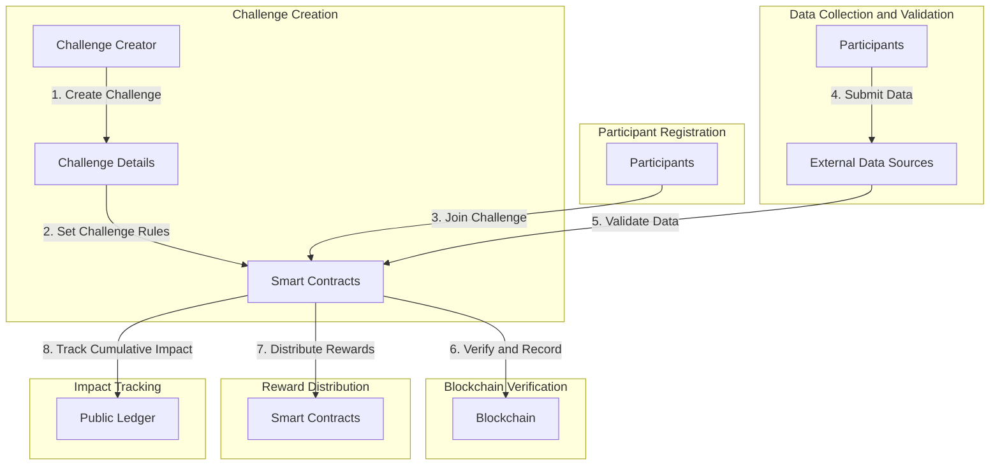

# Blockchain-Based Carbon Reduction Challenge Platform

## Project Overview
The Blockchain-Based Carbon Reduction Challenge Platform aims to motivate individuals, businesses, and communities to actively reduce carbon emissions through engaging challenges. This report provides a comprehensive overview of the project, including its objectives, implementation steps, advantages, and reasoning behind design decisions.

### Objectives
1. Encourage carbon reduction efforts.
2. Provide a transparent and secure platform.
3. Incentivize participants with rewards.
4. Showcase cumulative carbon reduction impact.

## Implementation Steps
### Step 1: Challenge Creation
- **Objective:** Enable users to create challenges.
- **Implementation:** Implement a user-friendly interface for challenge creation.
- **Advantages:** Customizable challenges.

### Step 2: Smart Contracts for Challenge Rules
- **Objective:** Define and enforce challenge rules.
- **Implementation:** Use Solidity for rule automation.
- **Advantages:** Fairness and automation.

### Step 3: Participant Registration
- **Objective:** Enable participation in challenges.
- **Implementation:** Develop a registration system.
- **Advantages:** Clear commitment records.

### Step 4: Data Collection and Validation
- **Objective:** Collect and validate carbon reduction data.
- **Implementation:** Integrate with data sources and oracles.
- **Advantages:** Reliable data.

### Step 5: Blockchain Verification
- **Objective:** Verify, record, and timestamp data.
- **Implementation:** Store validated data on the blockchain.
- **Advantages:** Security and immutability.

### Step 6: Reward Distribution
- **Objective:** Distribute rewards.
- **Implementation:** Use smart contracts for distribution.
- **Advantages:** Fair and automated rewards.

### Step 7: Impact Tracking
- **Objective:** Track cumulative impact.
- **Implementation:** Create a public ledger.
- **Advantages:** Motivation and awareness.

## Advantages of the Project
1. Incentivizes carbon reduction.
2. Security and transparency.
3. Community building.
4. Public ledger.
5. Automation.
6. Data reliability.

## Reasoning for Design Decisions
- **Blockchain:** Ensures transparency, security, and immutability.
- **Smart Contracts:** Automates complex processes.
- **Real-World Data Integration:** Enhances data reliability.
- **Gamification:** Makes carbon reduction engaging.

## Project Workflow

## Conclusion
The Blockchain-Based Carbon Reduction Challenge Platform offers an innovative and engaging approach to addressing carbon emissions. By providing incentives, transparency, and a sense of community, it has the potential to inspire positive environmental change on a global scale. The use of blockchain technology ensures the security and reliability of data, making it a powerful tool in the fight against climate change.

