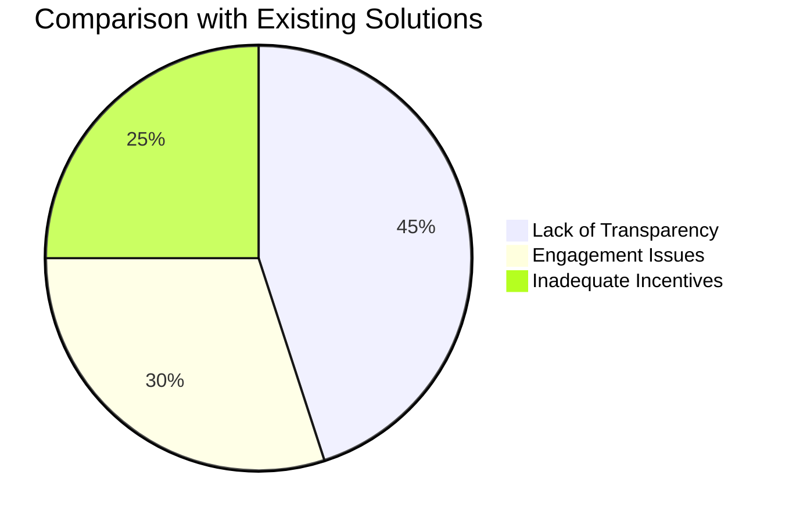
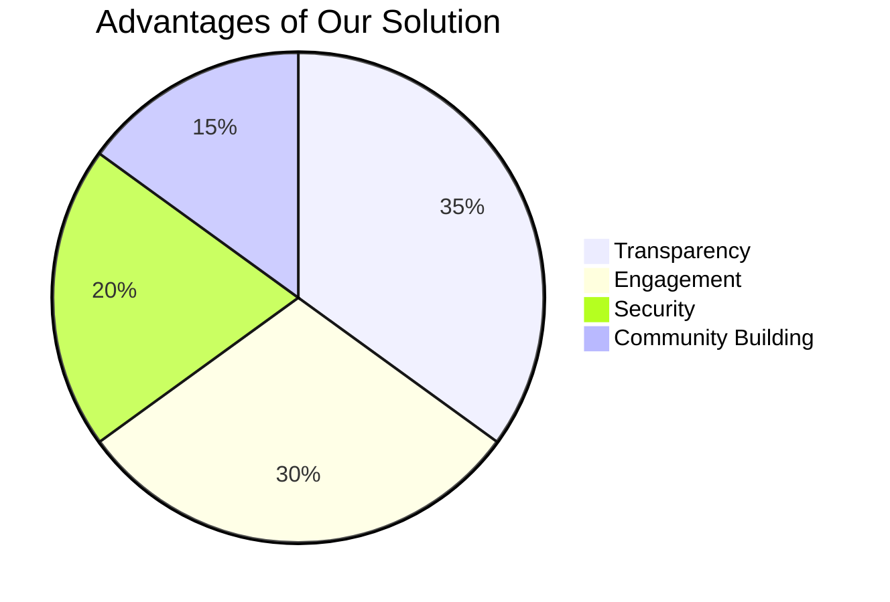
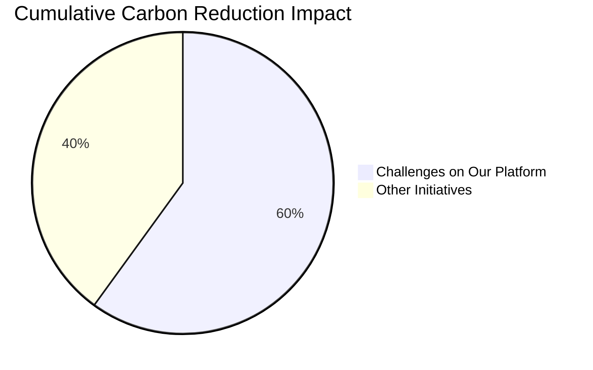
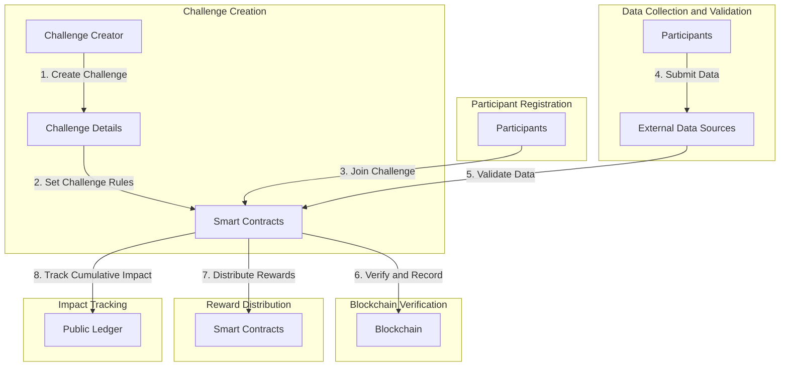
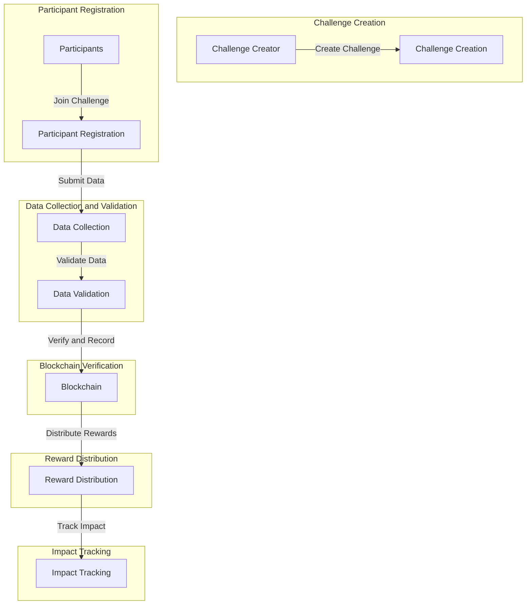
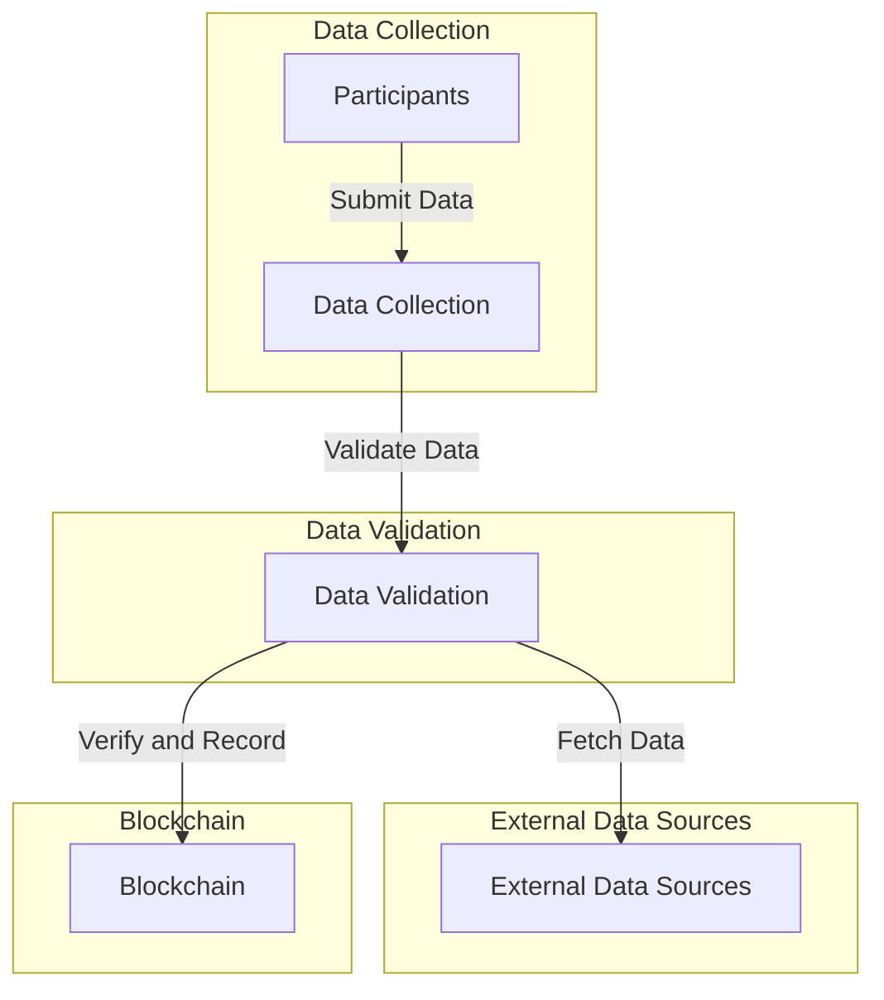

# Blockchain-Based Carbon Reduction Challenge Platform

## Problem Statement
**Background:**
Carbon emissions and climate change are pressing global concerns. Reducing carbon emissions at an individual, community, and corporate level is essential.

**Problem:** 
Existing carbon reduction initiatives lack transparency, engagement, and incentives for meaningful participation. There is a need for a platform that can address these shortcomings.

## Proposed Solution
The "Blockchain-Based Carbon Reduction Challenge Platform" is designed to tackle the problems associated with existing carbon reduction initiatives. It offers an engaging and transparent solution that motivates individuals and organizations to actively reduce their carbon emissions.

## Motivation
### Environmental Impact
- Global warming, climate change, and their consequences are motivating factors.
- Raising awareness about carbon reduction's positive impact on the environment.

### Transparency
- Existing systems often lack transparency, leading to mistrust.
- Blockchain ensures transparency, immutability, and auditability of data.

### Incentives
- Incentivizing participants with carbon credits and tokens.
- Motivating individuals and organizations to adopt sustainable practices.

## Contribution to the Domain
- **Transparency:** Utilizing blockchain technology to make the entire process transparent and tamper-proof.
- **Engagement:** Gamification elements motivate participants to sustain their carbon reduction efforts.
- **Security:** Secure data storage and smart contracts eliminate fraud risks.
- **Community Building:** Fostering a community committed to carbon reduction.

## Project Overview
The Blockchain-Based Carbon Reduction Challenge Platform aims to motivate individuals, businesses, and communities to actively reduce their carbon emissions through engaging challenges. This report provides a comprehensive overview of the project, including its objectives, implementation steps, advantages, and reasoning behind design decisions. Blockchain-powered platform that encourages individuals, businesses, and communities to participate in carbon reduction challenges. This idea leverages gamification, social impact, and blockchain's transparency to inspire positive environmental change.

## Objectives
The primary objectives of the project are as follows:

1. Encourage participants to take meaningful actions to reduce carbon emissions.
2. Provide a transparent and secure platform for tracking carbon reduction activities.
3. Incentivize participants with rewards in the form of carbon credits.
4. Create a public ledger showcasing the cumulative carbon reduction impact.
5. Gamification, social impact, and blockchain's transparency to inspire positive environmental change

## Implementation Steps

### Step 1: Challenge Creation
- **Objective:** Enable users or organizations to create carbon reduction challenges.
- **Implementation:** Implement a user-friendly interface that allows challenge creators to specify challenge details, such as name, duration, eligible activities, and rewards.
- **Advantages:** Empowers users to customize challenges to target specific carbon reduction goals.

### Step 2: Smart Contracts for Challenge Rules
- **Objective:** Define and enforce the rules of each challenge.
- **Implementation:** Use Solidity to create smart contracts that automate challenge rules, including tracking participants' progress and validating their submissions.
- **Advantages:** Ensures fairness, transparency, and automation in challenge management.

### Step 3: Participant Registration
- **Objective:** Enable participants to join carbon reduction challenges.
- **Implementation:** Develop a registration system where participants provide their details and commit to reducing carbon emissions through specific actions.
- **Advantages:** Creates a clear record of participants' commitment to carbon reduction.

### Step 4: Data Collection and Validation
- **Objective:** Collect and validate data related to participants' carbon reduction activities.
- **Implementation:** Integrate with external data sources or oracles (e.g., Chainlink) to collect real-world data, such as energy consumption records or transportation logs.
- **Advantages:** Ensures accuracy and reliability of carbon reduction data.

### Step 5: Blockchain Verification
- **Objective:** Use blockchain to verify, record, and timestamp validated data.
- **Implementation:** Store validated data on the blockchain, making it immutable and transparent.
- **Advantages:** Provides a secure and tamper-proof record of carbon reduction achievements.

### Step 6: Reward Distribution
- **Objective:** Automatically distribute rewards to participants who achieve their carbon reduction goals.
- **Implementation:** Smart contracts facilitate the distribution of rewards in the form of carbon credits or cryptocurrency tokens.
- **Advantages:** Ensures fair and timely reward distribution without the need for intermediaries.

### Step 7: Impact Tracking
- **Objective:** Track and showcase the cumulative carbon reduction impact.
- **Implementation:** Develop a public ledger that displays the total carbon emissions reduced through all challenges on the platform.
- **Advantages:** Motivates further participation by highlighting the collective impact.

## Advantages of the Project

1. **Incentivizing Carbon Reduction:** The project motivates individuals and organizations to actively participate in carbon reduction efforts by offering real rewards in the form of carbon credits.

2. **Security and Transparency:** Carbon credits are securely stored on the blockchain, ensuring transparency, immutability, and reduced fraud potential. Once a credit is sold, it cannot be duplicated or resold elsewhere.

3. **Community Building:** The platform fosters a sense of community by bringing together like-minded individuals and organizations committed to environmental sustainability.

4. **Public Ledger:** The public ledger showcases the cumulative carbon reduction impact, inspiring more participation and creating awareness about the importance of carbon reduction.

5. **Automation:** Smart contracts automate various aspects of challenge management, including data validation and reward distribution, reducing the need for manual intervention.

6. **Data Reliability:** Integration with external data sources and oracles ensures that carbon reduction data is accurate and verifiable.

## Reasoning for Design Decisions

- **Blockchain Technology:** Blockchain provides the foundation for transparent, secure, and tamper-proof record-keeping, making it an ideal choice for tracking carbon reduction achievements and managing rewards.

- **Smart Contracts:** Smart contracts automate complex processes, reducing the risk of errors and ensuring fairness in challenge management.

- **Real-World Data Integration:** Integrating with real-world data sources and oracles enhances the reliability and credibility of carbon reduction data.

- **Gamification:** The gamification aspect of challenges makes carbon reduction engaging and encourages long-term participation.

## Graphs and Charts

### Comparison with Existing Solutions

## Project Workflow

## High-Level Data Flow Diagram

## Low-Level Data Flow Diagram (Data Collection and Validation)

## Technology Stack

### Blockchain Platform
- **Choice:** Ethereum
- **Rationale:**
    - Ethereum is a well-established blockchain platform with a strong community and rich resources.
    - Supports smart contracts, essential for implementing challenge rules.
    - Ensures interoperability with other platforms.

### Smart Contracts Language
- **Choice:** Solidity
- **Rationale:**
    - Solidity is the most widely used language for Ethereum smart contracts.
    - Developer-friendly with a comprehensive development environment.
    - A large developer base ensures access to experienced talent.

### Front-End Development
- **Choices:** HTML, CSS, JavaScript, React
- **Rationale:**
    - HTML, CSS, and JavaScript form the foundation of web development.
    - React provides dynamic and responsive user interfaces, enhancing the user experience.

### Back-End Development
- **Choice:** Node.js
- **Rationale:**
    - Node.js is known for scalability and real-time capabilities.
    - Unified development environment facilitates integration with Ethereum and external data sources.

### Digital Identity Verification
- **Choices:** uPort or Sovrin
- **Rationale:**
    - uPort and Sovrin are decentralized identity solutions suitable for blockchain applications.
    - Enhance security and trust in user identity verification.

### External Data Integration
- **Choice:** Chainlink
- **Rationale:**
    - Chainlink is a widely recognized oracle solution, connecting smart contracts with real-world data.
    - Ensures reliable and secure data integration, crucial for validation.

## Project Workflow

### Challenge Creation
- Users or organizations create carbon reduction challenges through the user-friendly web interface.
- Smart contracts, written in Solidity, define challenge rules and logic.

### Participant Registration
- Participants register for challenges, providing their details and carbon reduction commitments.

### Data Collection and Validation
- Participants submit carbon reduction data.
- External data sources, connected through Chainlink oracles, fetch relevant real-world data.
- Data validation processes are initiated, ensuring the accuracy of submissions.

### Blockchain Verification
- Validated data is securely stored on the Ethereum blockchain.
- The blockchain provides immutability and transparency, ensuring the integrity of the recorded data.

### Reward Distribution
- Smart contracts facilitate the distribution of rewards, including carbon credits and tokens.
- Automation reduces the need for manual intervention, ensuring timely rewards.

### Impact Tracking
- A public ledger, also on the blockchain, tracks and showcases the cumulative carbon reduction impact of all challenges.

## Advantages of the Technical Choices

1. **Ethereum and Solidity:** Ethereum and Solidity provide a robust foundation for implementing smart contracts and managing blockchain transactions.

2. **Node.js:** Node.js offers scalability and real-time capabilities, enhancing the responsiveness of the platform.

3. **React:** React simplifies the development of dynamic and user-friendly front-end interfaces, improving user engagement.

4. **uPort/Sovrin:** Decentralized identity solutions enhance user trust and security during identity verification processes.

5. **Chainlink:** Chainlink ensures the reliability and security of external data integration, critical for validating carbon reduction activities.

## Platform

- We are selecting platform as Ethereum.

## Why are we using Ethereum platform for making carbon credits with blockchain

**Ethereum:** Ethereum is one of the most well-known blockchain platforms. It introduced the concept of smart contracts and decentralized applications (DApps) and uses the Ethereum Virtual Machine (EVM) to execute smart contracts. Ethereum has a large and active developer community.

- Using the Ethereum platform for creating and managing carbon credits with blockchain offers several advantages

1. **Established Ecosystem:** Ethereum is one of the most widely used and established blockchain platforms in the world. It has a large and active developer community, numerous decentralized applications (DApps), and extensive infrastructure, making it a strong choice for building carbon credit systems.

2. **Smart Contracts:** Ethereum introduced the concept of smart contracts, self-executing contracts with the terms of the agreement directly written into code. Smart contracts can be used to automate various aspects of carbon credit issuance, tracking, and trading, making the process more efficient and transparent.

3. **Interoperability:** Ethereum's Ethereum Virtual Machine (EVM) is the basis for many other blockchain platforms and tokens. This means that Ethereum-based carbon credits can potentially interoperate with a wide range of other blockchain projects, allowing for greater flexibility and adoption.

4. **Decentralization and Security:** Ethereum is a decentralized blockchain, which means that no single entity has complete control over it. This decentralization can enhance the security and trustworthiness of carbon credit systems, reducing the risk of fraud or manipulation.

5. **Transparency:** Blockchain technology, including Ethereum, offers transparency by providing an immutable ledger of all transactions and activities. This transparency is crucial for ensuring the legitimacy and traceability of carbon credits, which are often subject to verification and auditing.

6. **Global Reach:** Ethereum is a global platform, accessible to users and organizations around the world. This global reach is important for carbon credit systems, as they involve participants from different countries and regions.

7. **Tokenization:** Ethereum allows for the creation of custom tokens (ERC-20, ERC-721, etc.), which can represent carbon credits. These tokens can be easily traded on decentralized exchanges, providing liquidity and ease of access for buyers and sellers of carbon credits.

8. **Programmability:** Ethereum's programmable nature allows developers to create complex logic and rules for carbon credit issuance and management. This flexibility can accommodate various carbon credit standards and regulatory requirements.

9. **Scalability Solutions:** While Ethereum has faced scalability challenges, it is actively working on implementing solutions such as Ethereum 2.0 to improve transaction throughput and reduce fees, which can be important for carbon credit systems with high transaction volumes.

10. **Community Support:** Ethereum has a dedicated community working on sustainability and environmental initiatives. This community can provide valuable expertise and support for projects focused on carbon credits.

## Ethereum platform use cases to build carbon credits blockchain website

1. **Carbon Credit Issuance and Tracking:** Ethereum can be used to create a system for issuing and tracking carbon credits. Smart contracts on Ethereum can automate the process of verifying and issuing credits based on predefined criteria, such as emission reductions from sustainable practices.

2. **Transparency and Accountability:** Ethereum's transparency and immutability can be leveraged to create an auditable and transparent ledger of carbon credit transactions. Stakeholders, including regulators and participants, can easily verify the authenticity and history of carbon credits.

3. **Decentralized Carbon Credit Market:** Ethereum-based decentralized applications (DApps) can facilitate the creation of a peer-to-peer marketplace for buying and selling carbon credits. Smart contracts can ensure secure and trustless transactions.

4. **Global Participation:** Ethereum's global reach allows organizations and individuals from around the world to participate in carbon credit initiatives. This broadens the pool of potential participants, making it easier for projects to attract investors and buyers.

5. **Automated Verification:** Smart contracts can automate the verification of carbon credit claims. Data from IoT sensors or other sources can be fed into smart contracts to verify emission reductions automatically, reducing the need for costly and time-consuming manual verification.

6. **Fractional Ownership:** Ethereum's tokenization capabilities enable the creation of tokens representing fractions of carbon credits. This allows for more granular ownership and trading of carbon credits, making it accessible to a wider range of investors.

7. **Compliance and Regulatory Reporting:** Ethereum-based systems can automate compliance with environmental regulations by ensuring that carbon credits adhere to established standards. Reporting to regulatory authorities can also be automated.

8. **Carbon Credit Certification:** Ethereum can host decentralized autonomous organizations (DAOs) responsible for certifying and validating carbon credit projects. These organizations can use smart contracts to vote on project approvals and disburse credits.

9. **Offset Verification:** Ethereum-based DApps can provide a platform for offset verification, enabling organizations to prove their commitment to carbon neutrality by offsetting their emissions through certified credits.

10. **Carbon Credit Portfolios:** Investors can build and manage portfolios of carbon credits on Ethereum, diversifying their holdings and optimizing their impact on sustainability goals.

11. **Incentivizing Sustainable Practices:** Ethereum-based tokens can be used to incentivize sustainable practices by rewarding individuals or organizations for implementing environmentally friendly measures.

12. **Educational Platforms:** Ethereum-powered websites can offer educational resources and information related to carbon credits and sustainability, raising awareness and promoting responsible environmental practices.

13. **Carbon Credit Auditing:** Auditors can use Ethereum to access and verify carbon credit data, ensuring the accuracy and integrity of the carbon credit ecosystem.

14. **Integration with IoT:** Ethereum can be integrated with Internet of Things (IoT) devices to collect real-time data on emissions and sustainability practices, improving the accuracy of carbon credit calculations.

15. **Carbon Credit Tokenization for Crowdfunding:** Projects seeking funding for sustainable initiatives can tokenize their expected carbon credits on Ethereum, allowing individuals and organizations to invest in green projects and receive returns based on carbon credit performance.

By utilizing Ethereum's capabilities, carbon credit blockchain websites can address critical issues in the carbon credit market, including transparency, efficiency, and accessibility, ultimately contributing to global efforts to combat climate change and promote sustainability.

## Description about tools that what we are going to use in our project.

Building a website for carbon credits using blockchain and the Ethereum platform requires a combination of web development tools, blockchain tools, and Ethereum-specific tools. Here's a list of some of the key tools and technologies you might need:

### Web Development Tools

1. **Text Editor/IDE:** Integrated development environment (IDE) for writing code for this we are using Visual Studio Code and Atom.

2. **Version Control:** We are using Git and a platform like GitHub which helps in manage and collaborate on code efficiently.

3. **Front-End Framework:** We are using React for building the user interface because React allows us to create a modern, interactive, and user-friendly interface. This is crucial for presenting complex information about carbon credits and blockchain in a way that is easy for users to understand and navigate.

4. **HTML/CSS:** Fundamental web technologies for structuring and styling web content

5. **JavaScript:** For adding interactivity to your website.

4. **Responsive Design Tools:** Tools like Bootstrap can help us to create responsive web designs that work well on various devices.

### Blockchain Tools

1. **Solidity IDE:** An Integrated Development Environment for writing Solidity smart contracts, such as Remix or Visual Studio Code with Solidity extensions.
- Ethereum Development Environment: Setting up an Ethereum development environment, which includes Ethereum nodes and development frameworks like Truffle, Hardhat and remix
-Remix IDE: Remix is a web-based integrated development environment that allows us to write, test, and deploy smart contracts directly in our web browser. It's suitable for both beginners and experienced developers.

2. **Ganache:** A personal blockchain for Ethereum development and testing.

### Ethereum-Specific Tools

1. **Metamask:** A browser extension wallet for interacting with Ethereum dApps (decentralized applications) during development.

2. **Infura:** A service that provides access to Ethereum nodes via APIs, essential for deploying your smart contracts to the Ethereum mainnet or testnets.

3. **Web3.js or ethers.js:** JavaScript libraries for interacting with Ethereum smart contracts and the Ethereum blockchain.

4. **Smart Contract Development:** Remix is a tool for writing, compiling, and deploying smart contracts.

### Database and Backend Tools

1. **Database:** To store Off-Chain Metadata we are using MongoDB
- **Off-Chain Metadata:** Some data related to carbon credits, such as user profiles, project descriptions, or additional information, can be stored off-chain in a traditional relational or NoSQL database.
	- **MySQL:** A reliable relational database system.
	- **PostgreSQL:** Known for its advanced features and extensibility.
	- **MongoDB:** A NoSQL database suitable for flexible and unstructured data.
	- **DynamoDB:** A managed NoSQL database service provided by AWS, suitable for scalability and high availability.

2. **Server-Side Scripting:** Backend programming languages and frameworks such as Node.js, Python (with Flask or Django)

### Security Tools

1. **Security Auditing Tools:** Tools like MythX or Slither can help to analyze and secure our smart contracts.

2. **Penetration Testing Tools:** To ensure the security of your web application, consider using tools like OWASP ZAP or Burp Suite for security testing.

### Deployment and Hosting

1. **Web Hosting:** To deploy our website. We are using Heroku because Heroku is a cloud platform-as-a-service (PaaS) that allows developers to deploy, manage, and scale web applications and services with ease. It abstracts much of the infrastructure management, making it simpler for developers to focus on writing code and building their applications.

2. **Blockchain Deployment:** We are using Remix to deploy our smart contracts to the Ethereum mainnet or testnet.

3. **Domain Name Registrar:** Register a domain name for your website, and configure DNS settings we are using GoDaddy.
	- **GoDaddy:** GoDaddy is one of the largest and most well-known domain registrars in the world. They offer a variety of domain-related services, including domain auctions and website hosting.

## Entity-Relationship Diagram (ERD)

## Conclusion
The Blockchain-Based Carbon Reduction Challenge Platform offers an innovative and engaging approach to addressing carbon emissions. By providing incentives, transparency, and a sense of community, it has the potential to inspire positive environmental change on a global scale. The use of blockchain technology ensures the security and reliability of data, making it a powerful tool in the fight against climate change. Further development and collaboration with environmental organizations and stakeholders will be essential to realize the project's full potential.
